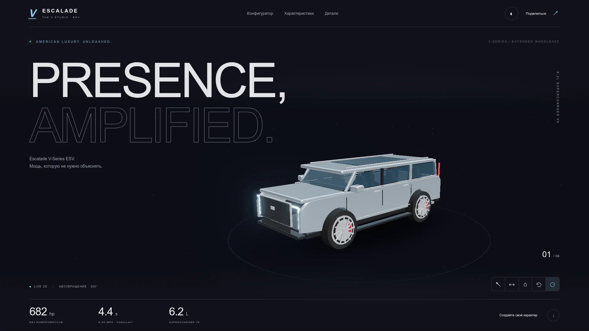
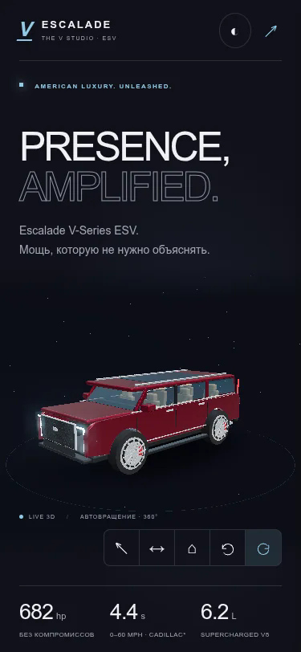

# The V Studio — Cadillac Escalade V-Series ESV

Иммерсивный статический 3D-конфигуратор: графитовый фон, ледяной акцент, Liquid Glass, студийный свет и интерактивный автомобиль. Русский интерфейс, HTML/CSS/ES-модули. Без backend, ключей API, платных сервисов, внешних CDN и аналитики.

**Важно:** независимый демонстрационный проект, не официальный продукт Cadillac. Авторская 3D-интерпретация, не заводская CAD-модель. Звук синтетический, не запись 6.2L. Справочные фотографии обычных Escalade, не V-Series ESV. Различия годов и неподтверждённые ориентиры явно подписаны.

## Возможности

- Three.js + GLTFLoader: локальный GLB, 358 деталей, физические материалы и освещение RoomEnvironment.
- OrbitControls: 360° мышью/касанием, колесо/pinch, демпфирование, автовращение через 5 секунд бездействия.
- Ракурсы спереди, сбоку, салон и сброс; клавиатура ←/→ и ↑/↓ или +/−.
- Bloom для светодиодных фар; хром отражает студийное окружение.
- 6 оттенков кузова и 4 оттенка кожи; изменение настоящих материалов `BodyPaint` / `Leather` за 0,5 секунды. Для салона — также крупный ракурс и образец отделки.
- Web Audio: запуск, холостой ход, перегазовка, burble, громкость, безопасная начальная громкость, небольшая вибрация камеры.
- Сравнение Escalade-V ESV / Yukon Denali Ultimate / Navigator L Black Label с ссылками и оговорками.
- Галерея 3 локальных лицензированных фото; кнопки и свайп.
- Технологии: AKG, 55″ Horizon Display, Super Cruise и Magnetic Ride Control. 36 динамиков у 2024 и 38 у новой версии не смешаны.
- Калькулятор топлива: километры, USD/литр, доля города; корректное взвешивание расхода, профили 11/16 и 11/17 mpg.
- Тёмная/светлая тема и сохранение выбора в localStorage.
- Ссылка на конфигурацию с `?paint=red&interior=beige#studio`, копирование в буфер.
- GSAP ScrollTrigger, параллакс, спокойные частицы и trailing cursor.
- `prefers-reduced-motion`, клавиатурное управление, видимый фокус, подписи, сообщения состояния, WebGL fallback и повторная загрузка.
- Service Worker: после появления **OFFLINE-READY / ВСЁ СОХРАНЕНО НА УСТРОЙСТВЕ** весь сайт, модель и фотографии работают офлайн.
- Относительные пути и корректный scope `/Cadillac-project/` для GitHub Pages.

## Скриншоты

Скриншоты реального Chromium. SVG-обёртки содержат встроенный растровый снимок и не зависят от работающего Pages-деплоя.





## Быстрый запуск

Нужен Node.js 22+ и npm.

```bash
git clone https://github.com/Karimov0913/Cadillac-project.git
cd Cadillac-project
npm ci
npm start
```

Открыть http://localhost:4173. `file://` не подходит: ES-модулям, GLTFLoader и Service Worker нужен HTTP(S). Не требуется Blender, серверная база данных или доступ к интернету во время работы сайта.

## GitHub Pages: публикация одной командой

**Статус публикации:** сайт опубликован на https://karimov0913.github.io/Cadillac-project/. Исправленный workflow `.github/workflows/pages.yml` успешно выполнил сборку и деплой: https://github.com/Karimov0913/Cadillac-project/actions/runs/37745453932.

Workflow выполняет тесты, сборку, загрузку артефакта `dist/` и публикацию при push в `main`. Не вставляйте команды терминала в YAML-файл. `deployment/pages.yml` — резервная копия правильного workflow. `npm run deploy` устанавливает этот шаблон, тестирует/собирает проект и отправляет коммит; альтернативно можно использовать обычный `git push` после коммита.

Первичная настройка GitHub: **Settings → Pages → Build and deployment → Source: GitHub Actions**. Проверьте, что Actions разрешены для репозитория.

После клонирования, `npm ci` и настройки авторизации Git:

```bash
npm run deploy
```

Команда тестирует, собирает, добавляет только известные файлы проекта, создаёт коммит при изменениях и выполняет `git push origin main`. GitHub Actions публикует сайт:

Адрес опубликованного сайта: **https://karimov0913.github.io/Cadillac-project/**

Для уже закоммиченных изменений достаточно `git push origin main`. Локальная сборка:

```bash
npm run build
npm run preview
```

Папку `dist/` можно разместить на любом статическом HTTPS-хостинге. В deploy-артефакте нет `node_modules`, исходных b64-обёрток и внешних запросов.

## Структура

```text
index.html
css/style.css
js/
  app.js                 # DOM, GSAP, тема, ссылки, калькулятор, офлайн-статус
  configurator.js        # Three.js, GLTFLoader, OrbitControls, bloom
  audio.js               # синтез Web Audio, рев и burble
  data.js                # палитра, сравнение, ссылки, формула расхода
assets/
  models/
    escalade-esv.glb.gz.b64
  images/
    exterior.webp.b64
    detail.webp.b64
    cabin.webp.b64
    preview-desktop.webp.b64
    preview-mobile.webp.b64
    preview-desktop.svg   # встроенный снимок для README
    preview-mobile.svg
    credits.json
    favicon.svg
  sounds/README.md        # почему нет сторонних аудиозаписей
scripts/
  build.mjs              # bundle, декодирование ассетов, генерация sw.js
  serve.mjs              # локальный HTTP-сервер
  generate-model.mjs     # воспроизводимый генератор оригинальной модели
  deploy.mjs             # однокомандная публикация
tests/
  data.test.mjs          # Node unit tests
  browser-qa.mjs         # функциональная браузерная проверка
  qa-results.json        # отчёт проверки
deployment/pages.yml      # резервная копия workflow
.github/workflows/pages.yml # активный workflow GitHub Actions
package.json
package-lock.json
SOURCES.md
LICENSE
README.md
```

### Почему бинарные ассеты записаны как `.b64`

Материалы доставлены в репозиторий через текстовый GitHub API. Чтобы не испортить GLB/WebP и сохранить воспроизводимость, бинарные файлы упакованы в base64, модель дополнительно gzip-сжата. `npm run build` восстанавливает **обычные GLB/WebP в `dist/assets/`**. Браузер не декодирует b64 и не загружает исходные транспортные файлы. Готовый архив `dist/` открывается через любой HTTP-сервер без npm.

Для изменения модели:

```bash
npm run model:generate
npm run build
```

Заменить модель можно своим лицензированным GLB: создайте `assets/models/escalade-esv.glb.gz.b64` как base64(gzip(GLB)). Нужные материалы должны называться `BodyPaint`, `Leather`, `Chrome`, `LightEmission`; ориентация — передняя часть по −X, Y вверх, размеры в метрах. Модель подключена через GLTFLoader, не через fallback-геометрию в браузере.

## Проверка

Локальный Chromium: **5 unit tests и 15 функциональных проверок прошли**, ошибок JavaScript/консоли не обнаружено. Проверены 375 и 1920 px, офлайн-перезагрузка, Web Audio с ненулевым PCM и fallback без WebGL. Результаты: `tests/qa-results.json`. Это проверка в тестовом окружении, не гарантия производительности на каждом устройстве.

```bash
npm test
```

Браузерный QA требует Playwright и Chromium в окружении разработчика, но **не является зависимостью production**. Для повторения:

```bash
npm install --no-save --package-lock=false playwright
npm run build
npm run preview
# в другом терминале:
CHROMIUM_PATH=/path/to/chromium QA_OUTPUT=/tmp node tests/browser-qa.mjs
```

Проверяются: 1920px и 375px, загрузка GLB, простой 5 секунд, остановка вращения при взаимодействии, ракурсы, кузов/кожа, ненулевой PCM через AudioAnalyser, газ/выхлоп, localStorage, буфер обмена, галерея, формула калькулятора, офлайн-перезагрузка и reduced motion. Скрипт падает при ошибках консоли.

На очень слабых устройствах WebGL может быть недоступен — используется явно подписанная фотография и кнопка повторной загрузки. Рендеринг приостанавливается вне экрана/в скрытой вкладке, DPR ограничен 1,5. Динамическое поведение WebGL и производительность могут отличаться между устройствами.

## Данные, лицензии и ограничения

Полная атрибуция и ссылки: [SOURCES.md](./SOURCES.md), `assets/images/credits.json`.

- Код и авторская 3D-модель — MIT.
- Фотографии Damian B Oh — **CC BY-SA 4.0**, не MIT; соответствующие подписи и ссылки сохранены.
- GSAP — собственная Standard License; Three.js/esbuild — MIT.
- Названия и марки Cadillac/GM, GMC, Lincoln, AKG и другие принадлежат владельцам.
- Палитра салона/кузова не гарантирует доступность реальных заводских опций. Синтетический звук не воспроизводит измеренную акустику автомобиля.
- Сравнение включает разные модельные годы и длины кузова. 4,4 с — оценка Cadillac для Escalade-V; 6,1 с — обзор двигателя GMC 6.2L, не отдельный тест Ultimate. 5,4 и 5,1 с из задания отдельно подписаны как неподтверждённые ориентиры.
- MSRP Escalade-V ESV $172 300 — официальный ориентир версии 2027, не цена 2025. Yukon Denali Ultimate 2024 $101 245 — MotorTrend. Navigator L Black Label 2024 $113 795 — каталог Motor Matchup. Ориентир $110 000 из задания показан отдельно. 5,34 с для Navigator — симуляция без rollout, не дорожный тест; 5,1 с в заголовке Motor Matchup — модель с 1ft rollout.
- 55″ нового дисплея не называется OLED в официальной спецификации. 36-динамиковая система относится к предыдущей версии.
- Калькулятор показывает только топливо, не полную стоимость владения. 11/17 mpg — сценарий из задания, базовый справочный профиль 2024 V — 11/16 mpg US.
- Офлайн работают локальные функции; внешние ссылки источников требуют сети. Clipboard API зависит от HTTPS и разрешений; при отказе предусмотрен fallback.
- При обновлениях Service Worker заменяет только собственный версионированный кэш. Для немедленной проверки обновлений перезагрузите страницу; при необходимости очистите site data.
